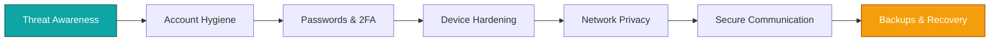

# 🌐 Online Privacy & Security — README (Polished, Dynamic & Graphical)

<div align="center">


[]() []()

</div>

---

## 🔎 What is this?

**Online Privacy & Security** is a practical, beginner-friendly repository that brings together clear guides, hands-on tools, and reproducible examples to help people protect personal data and understand common digital threats. The repo aims to teach *what* to do, *why* it matters, and *how* to do it safely — without scaring you off.

Ideal for:

* Students & hobbyists learning practical privacy hygiene
* Developers wanting secure defaults for apps & services
* Educators preparing short privacy/security modules

---

## ✨ Highlights

* Concise, actionable privacy checklists and threat model templates.
* Small, safe demo tools / scripts (e.g., config checkers, password hygiene helpers, simple encryption examples) — designed for learning, not production.
* Tutorials: browser hardening, secure messaging basics, endpoint hygiene, backups & recovery.
* `docs/` with step-by-step walkthroughs and visual diagrams.
* Ethical focus: guidance on legal and responsible use of tools.

---

## 🗂️ Suggested repo layout

```text
online-privacy-security/
├── README.md
├── docs/                          # Guides & how-to walkthroughs (browser, email, backups)
├── tools/                         # Small educational scripts (audit, config-checks, samples)
├── cheatsheets/                   # One-page checklists & posters
├── examples/                      # Config examples (privacy-first browser settings, .htaccess snippets)
├── resources/                     # Further reading, recommended tools (no binaries)
├── LICENSE
└── CONTRIBUTING.md
```

> Notes: The repo intentionally avoids shipping sensitive data, credentials, or heavy binaries.

---

## 🧭 Learning map (visual)



---

## 🚀 Quickstart — learn & try (safe, local)

1. Clone the repo:

```bash
git clone https://github.com/prak05/online-privacy-security.git
cd online-privacy-security
```

2. Read the core guide first:

* `docs/README.md` — start here for the roadmap.

3. Run example scripts (educational only):

```bash
# create a venv (optional but recommended)
python3 -m venv venv
source venv/bin/activate

# install if a requirements file exists
pip install -r requirements.txt  # if present

# run a safe demo (replace with actual script name)
python tools/privacy_audit_demo.py
```

> Always read the script and `docs/` before executing. Examples are educational and designed to run locally on non-sensitive data.

---

## 🧰 What you’ll find (selected)

* **Cheatsheets:** short, printable checklists for device setup and travel.
* **Guides:** browser privacy, secure email habits, secure backups, 2FA setup, password managers.
* **Tools (educational):** config auditors, entropy checks, simple encryption examples (e.g., using `cryptography`), password-strength analysis scripts.
* **Templates:** threat models, disclosure templates, responsible-use checklist for security research.
* **Resources:** curated list of privacy-respecting software and learning resources (no downloads included).

---

## ⚖️ Safety, Ethics & Legal

* This repo is **educational only**. It does **not** provide tools to attack systems or exploit vulnerabilities.
* Respect local laws and terms of service. Never run scanning or auditing tools against systems you do not own or have explicit permission to test.
* Privacy is a balance — we cover trade-offs (usability vs. anonymity) and how to make informed choices.

---

## 🤝 Contributing

Contributions welcome — especially: clearer docs, new checklists, safer demo scripts, or translations.

Please:

1. Fork → branch (`feat/harden-browser`) → commit → PR.
2. Add documentation for any script you add (purpose, inputs, outputs, safety notes).
3. Don’t commit secrets or large datasets. Use synthetic/sample data for examples.
4. Sign the CLA if requested by maintainers (if you add significant content).

See `CONTRIBUTING.md` for details.

---

## 🧭 Suggested next steps (for users)

* Start with **Account Hygiene**: strong passwords + password manager + 2FA.
* Harden your browser with a privacy checklist from `docs/browser-hardening.md`.
* Learn basic secure messaging and backups; test your recovery plan.
* Use the threat-model template before changing defaults on production services.

---

## 🧾 License

This project is licensed under the **MIT License**. See `LICENSE` for details.

---

## 👤 Author

**prak05** — privacy-conscious developer & educator.
If you want, I can:

* paste this as a ready-to-commit `README.md` for the repo, or
* generate `docs/README.md` + a one-page printable privacy checklist (in `cheatsheets/`) right now, or
* create three example `tools/` script templates (with safe sample data and docstrings) you can drop into the repo.

Which of those should I create and paste into the repo now?
